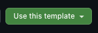

# Exercise: Implement a Status Effects System

## What is a Status Effect?

In RPGs, a status effect is a temporary or permanent condition applied to an actor. Examples:

- Poison deals damage over time.
- Stun prevents action for a duration.

These are all status effects -- they modify an actor's state, they have a type, a magnitude, and often a duration, and the game engine must be able to query, apply, and expire them.

## Task

Implement a per-actor status effects system for a deterministic game engine. Effects represent temporary or permanent conditions on an actor -- poison, stun, a posture change, an injury.

You'll find:

| Path | What it is |
|------|------------|
| [`src/scaffold/`](./src/scaffold/) | Type definitions and utilities provided to you. Do not modify these files. |
| [`src/effects/types.ts`](./src/effects/types.ts) | The `EffectType` enum and `EFFECT_LABELS`. You add your effect type values and display labels here. |
| [`src/effects/`](./src/effects/) | Status effects system -- stub files where your implementation goes. |
| [`src/command/`](./src/command/) | TICK_EFFECTS command -- stub file where your implementation goes. |
| [`src/narrative.ts`](./src/narrative.ts) | Client-side narrative renderer fixture. Do not modify. |
| `DESIGN.md` | Your design decisions, submitted alongside your code. |

---

## Constraints

These constraints are non-negotiable. They exist for specific engineering reasons. If your LLM produces code that violates any of these, fix it before submitting.

### Determinism

All game logic is deterministic. Same inputs produce same outputs, always.

### Errors Are Data

**Do not throw exceptions**. Use `TransformerContext.declareError()` instead.

```typescript
// CORRECT
if (!actor) {
  return context.declareError(command.id, ErrorCode.ACTOR_NOT_FOUND);
}

// WRONG
if (!actor) throw new Error('Actor not found');
```

### Events Are Declared in Reducers

Only reducer functions call `context.declareEvent()` and `context.declareError()`. The effects system (data structure, accessors, mutators, tick) never touches the context. The reducer decides what events to declare.

---

## What We Evaluate

We are looking for evidence that you understood the constraints, studied the `scaffold` code, and made deliberate design decisions -- not just that the code works.

- **Constraint adherence.** Does the code respect every constraint described above?
- **Design decisions.** The exercise leaves many choices to you: data layout, field design, function signatures. We want to see that your choices are intentional and consistent with each other and with the scaffold's conventions.
- **Efficient computation.** This system runs in a game loop. Access patterns, lookup cost, and iteration strategy matter.
- **Awareness of memory pressure.** Does the code allocate wastefully?
- **Narrative integration.** Do your events carry the right data for the renderer? Does your `EFFECT_LABELS` structure work with the fixture's bracket-notation access?
- **DESIGN.md.** Does the architectural overview communicate how the system works and why it's shaped the way it is?
- **Tests.** Do your tests cover boundary conditions and edge cases, or only the happy path?

---

## Game Design

### Effect Model

- An actor can have at most **one instance of each effect type** active at a time. For example, an actor can be poisoned and stunned simultaneously, but cannot have two separate poison effects.
- Each effect has a **type**, a **magnitude**, and optionally a **duration**. Effects with no duration are permanent.
- Effect types are defined in `src/effects/types.ts`. The `EffectType` enum is provided empty -- you populate it with your effect types. You must define at least a `POISONED` effect type.

You decide how to represent an effect's data -- what fields it has, how active/inactive is distinguished, and how permanence is represented.

### Narrative Layer

In production, a separate client-side layer turns events into player-facing text. The server never constructs narrative strings -- events carry integer fields, and the client renders prose from them.

A narrative renderer fixture is provided at [`src/narrative.ts`](./src/narrative.ts). It simulates the client renderer. **Do not modify it.** The renderer reads fields directly from your event objects. Its function signatures declare which fields it expects via intersection types:

```typescript
renderEffectStart(actorName, event: WorldEvent & { effectType: number; magnitude: number })
renderEffectEnd(actorName, event: WorldEvent & { effectType: number })
```

Your `EffectDidStart` and `EffectDidEnd` classes must carry these fields as integers. Display labels are resolved from `EFFECT_LABELS` via bracket notation: `EFFECT_LABELS[event.effectType]`. You export `EFFECT_LABELS` from `src/effects/types.ts` alongside your `EffectType` enum. You choose the data structure.

Expected output examples:

```
"Kael is afflicted with Poison (intensity 5)."
"Poison on Kael has ended."
```

### Requirements

**Data structure.** Design a representation for an actor's effects. You choose the layout.

**Operations.** Implement these functions in `src/effects/effects.ts`. You design the signatures.

| Function | What it does |
|----------|-------------|
| `createEffects` | Returns a new, empty effects container. All effects inactive. |
| `resetEffects` | Clears all effects in an existing container. |
| `applyEffect` | Applies a timed effect with a given magnitude and expiry. |
| `applyPermanentEffect` | Applies a permanent effect (one that never expires). |
| `clearEffect` | Deactivates a single effect by type. |
| `isEffectActive` | Returns whether the given effect type is currently active. |
| `getEffectMagnitude` | Returns the magnitude of a given effect type. |
| `tickEffects` | Iterates all effects. Skips inactive and permanent effects. For any timed effect whose expiry has elapsed (`now >= expiry`), clears the effect. The calling reducer needs to know which effects expired (and their data at the time of expiry) so it can declare events. You design how `tickEffects` communicates this. This function is called by the `TICK_EFFECTS` reducer in a loop over actors -- consider what that implies for its allocation behaviour. |

**Events.** Implement `EffectDidStart` and `EffectDidEnd` event classes in `src/effects/events.ts`.

### TICK_EFFECTS Command

A `TICK_EFFECTS` command advances the status effects clock. Its reducer walks every actor in the world, calls `tickEffects` on each actor's effects container, and declares an `EffectDidEnd` event for every effect that expired.

A stub is provided in `src/command/TICK_EFFECTS.ts`. The command class is already wired -- implement the reducer and return `context`.

---

## What to Deliver

### Code

Fill in the stub files:

| File | Purpose |
|------|---------|
| `src/effects/types.ts` | Your `EffectType` enum values and `EFFECT_LABELS` |
| `src/effects/effects.ts` | The effects system: data structure, operations, and `tickEffects` |
| `src/effects/events.ts` | `EffectDidStart` and `EffectDidEnd` event classes |
| `src/effects/effects.spec.ts` | Tests for the effects system (starter tests provided; add your own) |
| `src/command/TICK_EFFECTS.ts` | Reducer core (command and composition are provided) |
| `src/command/TICK_EFFECTS.spec.ts` | Tests for the reducer (starter tests provided; add your own) |

### DESIGN.md

A high-level architectural overview of the status effect system you designed.

---

## Setup

```bash
npm install
npm test           # run tests (vitest)
npm run typecheck   # run the type checker
```

---

## Submitting

1. Click **Use this template** at the top of this repository to create your own copy.

   

2. Complete the exercise in your repository.
3. Share the link with us. If you made your repository private, add [`industrydigital-rich-choy`](https://github.com/industrydigital-rich-choy) as a collaborator.
